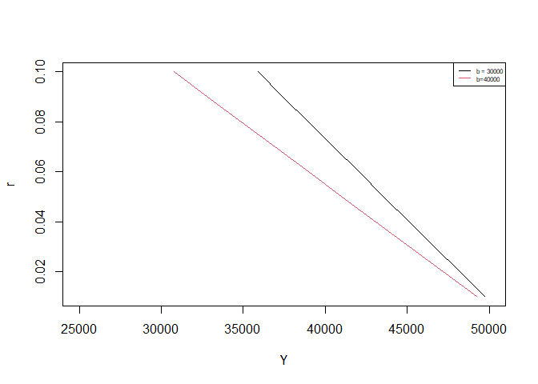
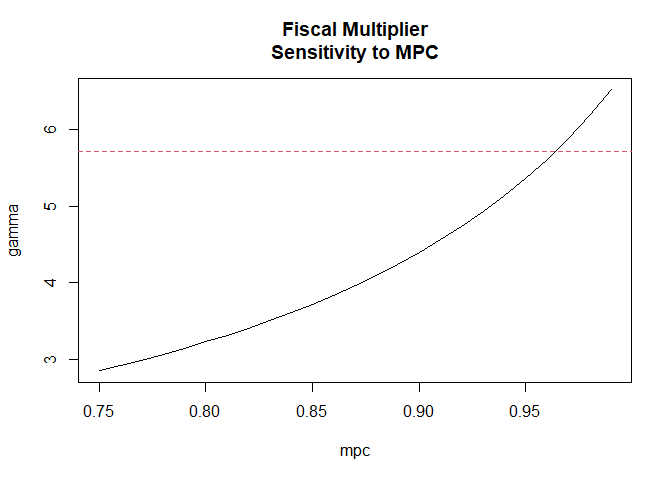
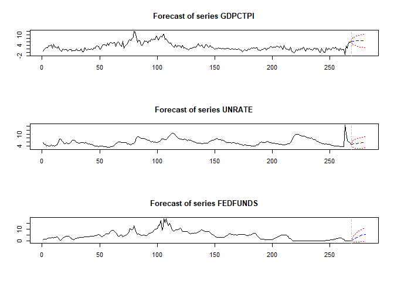

README
================
2022-03-23


\##Purpose

This project is an attempt by myself to master macroeconomic modelling
within R.

``` r
pacman::p_load(quantmod)

getSymbols(c('GDPC1','CPIAUCSL'),src='FRED') #Real GDP per Capita
```

    ## [1] "GDPC1"    "CPIAUCSL"

``` r
df <- merge(GDPC1,CPIAUCSL)
df <- na.omit(df)
decades <- paste(seq(1950,2010,by=10),'-01-01',sep='')
decades<- df[as.character(index(df))%in% decades,]
plot(as.numeric(decades[,1]),as.numeric(decades[,2]),ylab='Price',xlab='Output, Income',ylim=c(0,300))
abline(v = as.numeric(decades[,1]))
text(as.numeric(decades[,1]),rep(150,nrow(decades)),paste('Agg. Supply',c(50,60,70,80,90,'00',10)),pos=2,srt=90,cex=0.5)
```


These models describe how the economy is expected to evolve over
decades. If you recall, the long-run models had full price and wage
flexibility. In a frictionless economy, employment and output are always
at the full-employment level.

Along the way to these long-run equilbriums economies experience a
variety of that make movements to the equilbrium not as smooth as
predicted by the long-run models. To capture these shocks we will
introduce models for short-run dynamics. One of the core assumptions we
are going to make in our analysis is that in the short-run prices are .
That is, prices are assumed to not move. Furthermore, we will assume
that producers will be willing to supply as many goods as demanded at
that sticky price level.

To clarify, in the short-run we are talking about models that desribe
the economy over the course of a few months. The assumptions above all
indicate that in the short-run aggregate supply is actually a horizontal
line.

\#Aggregate Supply Adjustment Process

The dynamics that will allow us to transition from short-run to long-run
are goverened by the . Phillips in 1958 found an empirical observation
that there is an inverse relationship between the rate of unemployment
and the rate of increase in wages. The higher the rate of unemployment,
the lower the rate of wage inflation. Let

be the wage this preiod, and

be the wage next period, wage inflation is therefore:


The relation with unemployment can be written as:

")

Here

is the current prevailing rate of unemployment and

is the rate of unemployment in the economy (assuming no frictions, no
efficency wage theory, labor unions, coordination problems, etc.).

We can also write this in terms of the level of wages:

)")

which tells us that for wages to rise above their previous level,
unemployment must fall below the natural rate.

This relation held beautifully in the 1960s:

``` r
getSymbols(c('UNRATE','CPIAUCSL'),src='FRED') #Real GDP per Capita
```

    ## [1] "UNRATE"   "CPIAUCSL"

``` r
head(CPIAUCSL)
```

    ##            CPIAUCSL
    ## 1947-01-01    21.48
    ## 1947-02-01    21.62
    ## 1947-03-01    22.00
    ## 1947-04-01    22.00
    ## 1947-05-01    21.95
    ## 1947-06-01    22.08

``` r
unemp_cpi <- na.omit(merge(UNRATE,100*Delt(CPIAUCSL,k=12)))
colnames(unemp_cpi) <- c('UNEMP','CPI')
head(unemp_cpi)
```

    ##            UNEMP       CPI
    ## 1948-01-01   3.4 10.242086
    ## 1948-02-01   3.8  9.481961
    ## 1948-03-01   4.0  6.818182
    ## 1948-04-01   3.9  8.272727
    ## 1948-05-01   3.5  9.384966
    ## 1948-06-01   3.6  9.375000

``` r
sixties <- unemp_cpi[grep('^196',index(unemp_cpi)),]
plot(as.numeric(sixties[,1]),as.numeric(sixties[,2]),xlab='Unemployment Rate',ylab='Inflation Rate (CPI YoY)')
```


But fell into controversy as time passed:

``` r
plot(as.numeric(unemp_cpi[,1]),as.numeric(unemp_cpi[,2]),xlab='Unemployment Rate',ylab='Inflation Rate (CPI YoY)')
```


In the 70s when the short-run relationship with unemployment and
inflation broke down the model was extended to include expectations:

")

When workers and firms bargain over wages, they are concerned with the
real value of the wage. As a result workers and firm attempt to include
in their contracts their expecations about future inflation. This
formulation is known as the Inflation-Expectation Augmented Phillips
curve. If we assume that real wages are constant, actual price inflation
is the same as wage inflation:

")

If we make the assumption that expected inflation is simply the
inflation in the previous period, how well does the expectations
augmented Phillips curve fit the data if we assume that
?

``` r
#Look for rows that end with -12-01 -> get the last month of every year
unemp_cpi_annual <- unemp_cpi[grep('-12-01$',index(unemp_cpi)),]
head(unemp_cpi_annual)
```

    ##            UNEMP        CPI
    ## 1948-12-01   4.0  2.7338744
    ## 1949-12-01   6.6 -1.8295218
    ## 1950-12-01   4.3  5.8026260
    ## 1951-12-01   3.1  5.9647718
    ## 1952-12-01   2.7  0.9066868
    ## 1953-12-01   4.5  0.5990266

``` r
mdl <- lm(diff(unemp_cpi_annual[,2]) ~ unemp_cpi_annual[,1])
summary(mdl)
```

    ## 
    ## Call:
    ## lm(formula = diff(unemp_cpi_annual[, 2]) ~ unemp_cpi_annual[, 
    ##     1])
    ## 
    ## Residuals:
    ##     Min      1Q  Median      3Q     Max 
    ## -6.4862 -0.9853 -0.1653  0.6690  6.9227 
    ## 
    ## Coefficients:
    ##                       Estimate Std. Error t value Pr(>|t|)   
    ## (Intercept)             2.6408     0.9393   2.811  0.00637 **
    ## unemp_cpi_annual[, 1]  -0.4491     0.1573  -2.855  0.00564 **
    ## ---
    ## Signif. codes:  0 '***' 0.001 '**' 0.01 '*' 0.05 '.' 0.1 ' ' 1
    ## 
    ## Residual standard error: 2.176 on 71 degrees of freedom
    ##   (1 observation deleted due to missingness)
    ## Multiple R-squared:  0.103,  Adjusted R-squared:  0.09033 
    ## F-statistic: 8.149 on 1 and 71 DF,  p-value: 0.005643

``` r
plot(as.numeric(unemp_cpi_annual[,1]),diff(unemp_cpi_annual[,2]),xlab='Unemployment Rate',ylab='Change in Inflation Rate (CPI YoY)')
abline(mdl,col = 4)
text(9,6,'diff CPI = 2.3941 - 0.41U')
```


``` r
#pi - pi_{t-1} = -beta(u -u*) + error
#Let u* be a constant 
#pi - pi_{t-1} = beta u* - beta u + error
#constant = beta u*
#pi - pi_{t-1} = constant - beta u + error
# -> constant/beta = u*
nairu <- mdl$coefficients[1]/abs(mdl$coefficients[2])
nairu
```

    ## (Intercept) 
    ##    5.879634

``` r
#Or 
##(pi - pi_{t-1})/beta + u = u*  + error/beta
u_star_plus_v <- as.numeric(unemp_cpi_annual[,1]) + as.numeric(diff(unemp_cpi_annual[,2]))/abs(mdl$coefficients[2])
plot(index(unemp_cpi_annual)[-c(1:12)],u_star_plus_v[-c(1:12)],typ='l',ylab='NAIRU')
library(quantmod)
smooth_ustar <- SMA(u_star_plus_v,12)
lines(index(unemp_cpi_annual),smooth_ustar,col = 4,lwd=2)
legend('bottomleft',legend = c('U* + error/beta','U*'),lty = 1,col = c(1,4),lwd=c(1,4),cex=0.75)
```


Using a simple linear regression we have that
,
indicating that one extra point of unemployment reduces inflation by
about one-half of a percentage point. Keep in mind the current size of
the civilian labor force is \~162 million individuals. A one percentage
point up tick in unemployment corresponds to about 1.62 million people
losing their jobs. Nonetheless, this estimate tells us that the
short-run Phillips curve is quite flat, even though we know that the
long-run Phillips curve is vertical (at the natural rate of
unemployment).

So far we have discussed the relationship between inflation and
unemployment. We can extend the model to be our short-run aggregate
supply function by making a link between unemployment and output. makes
this exact connection, where 1 extra point of unemployment costs about 2
percent of GDP:

")

``` r
getSymbols(c('GDPC1','UNRATE'),src='FRED') #Real GDP per Capita
```

    ## [1] "GDPC1"  "UNRATE"

``` r
gdp_unrate <- merge(GDPC1,UNRATE)
gdp_unrate <- na.omit(gdp_unrate)
gdp_unrate[,1] <- 100*Delt(gdp_unrate[,1],k=4)
gdp_unrate[,2] <- diff(gdp_unrate[,2],lag=4)
head(gdp_unrate)
```

    ##                 GDPC1 UNRATE
    ## 1948-01-01         NA     NA
    ## 1948-04-01         NA     NA
    ## 1948-07-01         NA     NA
    ## 1948-10-01         NA     NA
    ## 1949-01-01  0.9369841    0.9
    ## 1949-04-01 -1.0408130    1.4

``` r
gdp_unrate <- na.omit(gdp_unrate)
#gdp_unrate <- gdp_unrate[grep('-10-01',index(gdp_unrate)),]
#head(gdp_unrate)
mdl2 <- lm(gdp_unrate[,1]~gdp_unrate[,2])
plot(as.numeric(gdp_unrate[,2]),as.numeric(gdp_unrate[,1]),ylim=c(-4,11),xlim=c(-3,4),xlab='Change in Unemployment',ylab='Growth of Real GDP')
abline(mdl2,col=4)
```


``` r
summary(mdl2)
```

    ## 
    ## Call:
    ## lm(formula = gdp_unrate[, 1] ~ gdp_unrate[, 2])
    ## 
    ## Residuals:
    ##     Min      1Q  Median      3Q     Max 
    ## -4.7130 -1.2911 -0.1075  1.2769  5.1999 
    ## 
    ## Coefficients:
    ##                 Estimate Std. Error t value Pr(>|t|)    
    ## (Intercept)      3.15393    0.10379   30.39   <2e-16 ***
    ## gdp_unrate[, 2] -1.35534    0.06709  -20.20   <2e-16 ***
    ## ---
    ## Signif. codes:  0 '***' 0.001 '**' 0.01 '*' 0.05 '.' 0.1 ' ' 1
    ## 
    ## Residual standard error: 1.773 on 290 degrees of freedom
    ## Multiple R-squared:  0.5846, Adjusted R-squared:  0.5832 
    ## F-statistic: 408.2 on 1 and 290 DF,  p-value: < 2.2e-16

The next step is to make a more formal link between wages and prices.
Suppose firms set prices to a fixed markup above their costs:

W_{t}}{a}")

}")

Here we assume that firms charge price

for their output, which is
")
greater than their cost per unit (a is the number of units, W is the
wage).

Plugging the above into our expectations-augmented Phillips curve:

")

")

)+W_{t}")

} = \frac{aP_{t}}{(1+z)}(\pi_{e}  -\epsilon(u-u^{*}))+\frac{aP_{t}}{(1+z)}")

)+P_{t}")

)+P_{t}")

)")

Using Okun’s Law:

")

")

")

")

Recall that above we estimated

and
,
which tells us that
.
When output exceeds the rate of output by 4%, inflation increases by 1%,
holding inflationary expectations constant. Similarly a 4% decrease in
output will reduce inflation by 1%. (Most estimates are in the range of
2-4%).

For simplicity we can approximate our Phillips curve as:

)")

Here


This is our aggregate supply curve under the condition in which wages
are less than fully flexible. Price increases with the level of output
because increased output implies increased employment and therefore
higher labor costs, which are passed along through the fixed markup.
Inflation expectations shift the aggregate supply curve up and down over
time, while the steepness is goverened by the link of inflation and
output through unemployment.

\#Aggregate Demand

\##Goods Market

So far we have only disscussed the supply-side of the economy, that is
the producer side of the economy. The flip-side of the coin is what
households, businesses, government, and foreigners wish to consume.
Recall our national income accounts identity which summarized all
aggregate demand (AD) for the goods market:


We can expand this identity by making assumptions about the structure of
each of our variables:

")


Here a

above a variable denotes that it is exogenously fixed at some autnomous
level.

")

> 
> denotes the level of autonomous spending of consumers, that is the
> amount household will spend regardless of their income.
> 
> is the disposable income level of consumers (income less taxes plus
> transfer payments from the government)
> 
> is the marginal propensity to consume. For each dollar increase in
> disposable income,
> 
> will be consumed and
> 
> will be saved.


> 
> is the governments tax revenue
> 
> is an exogenous amount of transfer payments the government make to
> households (think of social security, food stamps, unemployment
> benefits)
> 
> is the autonomous level of government spending and investment. Note
> that our definition of government includes federal, state and local
> governments.


> We are assuming there is some fixed level of investment that exists in
> the economy regardless of interest rates
> .
> There is an inverse relationship between the amount of investment that
> takes place and the prevailing interest rate
> 
> in the economy. The higher the interest rate the lower the amount of
> investment that takes place. The degree to which investment responds
> to interest rates is goverened by
> ;
> a large
> 
> implies a small increase in
> 
> will lead to a large decline in investment and a small
> 
> implies a large increase in
> 
> will have a small effect on investment. Generally,
> 
> is assumed to be large.


> We are keeping net exports fixed at some exogenous level for now.
> Extensions of this model that explicitly model net exports is called
> the Mundell-Flemming model. Substituting all of these equations into
> our national income accounts identity:

 + \bar{I} - br + tY - ztY - \bar{G}+ \bar{NX}")

Given that we have a few variables that are all autonomous (fixed at
some level) we can further simplify to:

 - br")

where
.
In equilbrium aggregate demand equals aggregate supply:

 + t - zt)  - br")

We can group common terms and solve for output:

 + t - zt)}")

or,

")

Where
 - t(1-z)}").
This equation is actually known as the investment-savings curve, which
is one-half of the cannonical IS-LM framework which characterizes the
equilbrium between goods and money markets. This equation tells us there
exists a negative relationship between interest rates and output/income
as a result of the amount of investment in the economy declining as
interest rates rise.

``` r
#Change in marginal propensity to consume
mpc <- 0.8
tax_rate <- 0.25
z <- 0.9
autonomous_spend <- 10000
r <- seq(0.1,0.01,by=-0.01)
b <- 30000
alpha_g <- 1/(1+mpc*(tax_rate - 1 - z*tax_rate) -tax_rate*(1-z))
Y <- alpha_g*(autonomous_spend-b*r)
plot(Y,r,typ='l',xlim=c(35000,145000))
mpc2 <- 0.9
alpha_g2 <- 1/(1+mpc2*(tax_rate - 1 - z*tax_rate) -tax_rate*(1-z))
Y_2 <- alpha_g2*(autonomous_spend-b*r)
lines(Y_2,r,col=2)
legend('topright',legend = c('c = 0.8','c=0.9'),lty=1,col=1:2,cex=0.5)
```


``` r
b_2 <- 40000
plot(Y,r,typ='l',xlim=c(25000,50000))
Y_2 <- alpha_g*(autonomous_spend-b_2*r)
lines(Y_2,r,col=2)
legend('topright',legend = c('b = 30000','b=40000'),lty=1,col=1:2,cex=0.5)
```



Our first plot above indicates that an increase in the marginal
propensity to consume
()
leads to a flatter IS curve. An increase in

also leads to a faltter IS curve. A flatter IS curve implies small
changes in in the interest rate
()
lead to large changes in output/income
().
In general the slope of our IS curve is determined as follows:

")


Here

is our intercept and

is our slope. Notice that in both of our plots there was a shift in the
IS curve. By how much does the IS curve shift for a given change in the
level of autonomous spending?

")


Income changes by

times the changes in autonomous spending. This tells us that if for
instance government spending

changes, the IS curve will shift by
.
Notice this is a shift in the IS curve as this implies the level of
income will change for any given interest rate.

\##Money Markets

To fully characterize aggregate demand we need to also study the demand
for real money balances in the economy. We need this secondary market to
determine the prevailing interest rate in the economy. Furthermore, this
second market will allow for money to play a role in the economy, which
is ignored in the goods market. From our study of the quantity theory of
money we know that money and central banks play a key role in the
economy. Generically, the demand for real money balances depends on the
level of real income and the interest rate. Where the demand for real
money balances should be positively related to real income (more income
means more spending, you need more real money balances to facilitate the
transactions) and should be negatively related to interest rates (higher
interest rates imply a large opportunity cost for holding real money
balances). We can mathematically characterize these relationships as:


Here we have that the demand for real money balances is decreasing for a
given level of income (Y);
.

is the money supply assumed to be fixed and determined by the central
bank.

is also assumed to be fixed, as we are analyzing the market for money at
a snapshot in time (short-run model). We can re-arrange a few terms to
solve for the interest rate in this economy:

")

This is our liquidity-money (LM) component of our IS-LM model. The slope
of the LM curve is govered by
.
The larger

relative to

the steeper the LM curve will be. As
,
the LM curve is vertical and as

the LM curve is horizontal. Changes in the real money supply will lead
to shifts in the LM curve as the intercept will change.

\##Equilibrium in the Goods and Money Market

We can combine our investment-savings and liquidity-money equations to
solve for the equilbrium level of output and interest in an economy. The
point of intersection is where our goods and money market clear.

\ r=\frac{1}{h}(kY-\frac{\bar{M}}{\bar{P}})")

\ Y=\frac{1}{k}(\frac{\bar{M}}{\bar{P}} + hr)")

\ Y = \alpha_{G}(\bar{A} - br)")

We have two equations and two unkowns, we can plug in the LM curve into
the IS curve and solve for the equilbrium level of output then solve for
the equilbrium interest rate.

")

\]

")

)")


Let

then:


Now we can plug in and solve for interest rates:

-\frac{\bar{M}}{\bar{P}})")

}\frac{\bar{M}}{\bar{P}}-\frac{1}{h}\frac{\bar{M}}{\bar{P}})")

}\frac{\bar{M}}{\bar{P}}-\frac{(h+b\alpha_{G}k)}{h(h+b\alpha_{G}k)}\frac{\bar{M}}{\bar{P}}")

}\frac{\bar{M}}{\bar{P}}")

Using the previously defined


Recall that in the IS-LM framework we are looking at the economy in the
very short-run where we assume that prices are sticky. In the long-run
with flexible prices our definition of

remains the same but we have a flexible price level. Given that

is in the denominator of our definition of equilbrium output, as prices
rise output falls and as prices fall output increases. This is in fact
our definition of aggregate demand for given levels of autonomous
consumption

and given levels of the money supply
.

\##Calibration

``` r
#Real Disposable Personal Income: Per Capita (A229RX0)
#Real personal consumption expenditures per capita (A794RX0Q048SBEA)
library(quantmod)
getSymbols(c('A794RX0Q048SBEA','A229RX0'),src = 'FRED')
```

    ## [1] "A794RX0Q048SBEA" "A229RX0"

``` r
consumption_data <- merge(A794RX0Q048SBEA,A229RX0)
consumption_data <- na.omit(consumption_data)
head(consumption_data)
```

    ##            A794RX0Q048SBEA A229RX0
    ## 1959-01-01           10949   12464
    ## 1959-04-01           11075   12606
    ## 1959-07-01           11143   12646
    ## 1959-10-01           11106   12529
    ## 1960-01-01           11147   12705
    ## 1960-04-01           11220   12690

``` r
consumption_mdl <- lm(consumption_data[,1]~consumption_data[,2])
summary(consumption_mdl)
```

    ## 
    ## Call:
    ## lm(formula = consumption_data[, 1] ~ consumption_data[, 2])
    ## 
    ## Residuals:
    ##      Min       1Q   Median       3Q      Max 
    ## -10886.4   -266.3      5.3    396.7   1669.6 
    ## 
    ## Coefficients:
    ##                         Estimate Std. Error t value Pr(>|t|)    
    ## (Intercept)           -5.213e+02  1.949e+02  -2.674  0.00798 ** 
    ## consumption_data[, 2]  9.050e-01  6.581e-03 137.526  < 2e-16 ***
    ## ---
    ## Signif. codes:  0 '***' 0.001 '**' 0.01 '*' 0.05 '.' 0.1 ' ' 1
    ## 
    ## Residual standard error: 1034 on 250 degrees of freedom
    ## Multiple R-squared:  0.987,  Adjusted R-squared:  0.9869 
    ## F-statistic: 1.891e+04 on 1 and 250 DF,  p-value: < 2.2e-16

``` r
#Real Gross Private Domestic Investment (GPDIC1)
#10-Year Treasury Inflation-Indexed Security, Constant Maturity (DFII10)
getSymbols(c('GPDIC1','DFII10'),src = 'FRED')
```

    ## [1] "GPDIC1" "DFII10"

``` r
investment_data <- merge(GPDIC1,DFII10)
investment_data <- na.omit(investment_data)
head(investment_data)
```

    ##              GPDIC1 DFII10
    ## 2003-04-01 2233.997   2.02
    ## 2003-07-01 2315.399   1.92
    ## 2003-10-01 2393.402   1.96
    ## 2004-04-01 2493.945   1.48
    ## 2004-07-01 2532.635   2.04
    ## 2004-10-01 2585.477   1.83

``` r
investment_data[,2] <- investment_data[,2]/100
investment_mdl <- lm(investment_data[,1]~investment_data[,2])
summary(investment_mdl)
```

    ## 
    ## Call:
    ## lm(formula = investment_data[, 1] ~ investment_data[, 2])
    ## 
    ## Residuals:
    ##     Min      1Q  Median      3Q     Max 
    ## -769.05 -222.12   35.62  215.53  727.47 
    ## 
    ## Coefficients:
    ##                       Estimate Std. Error t value Pr(>|t|)    
    ## (Intercept)            3091.07      70.46  43.872  < 2e-16 ***
    ## investment_data[, 2] -38831.03    5766.87  -6.733 4.42e-08 ***
    ## ---
    ## Signif. codes:  0 '***' 0.001 '**' 0.01 '*' 0.05 '.' 0.1 ' ' 1
    ## 
    ## Residual standard error: 357.2 on 40 degrees of freedom
    ## Multiple R-squared:  0.5313, Adjusted R-squared:  0.5196 
    ## F-statistic: 45.34 on 1 and 40 DF,  p-value: 4.416e-08

``` r
mpc <- coef(consumption_mdl)[2]
tax_rate <- 0.25 #made it up
z <- 0.9 #made it up
#+coef(investment_mdl)[1] + coef(consumption_mdl)[1] +
autonomous_spend <- 3600  #guessing 
r <- seq(0.05,0.001,by=-0.0001) 
b <- coef(investment_mdl)[2]*-1 #Each 1 percentage point increase in interest rates leads to a decrease of investment of 260.3473 billion
alpha_g <- 1/(1+mpc*(tax_rate - 1 - z*tax_rate) -tax_rate*(1-z))
IS <- alpha_g*(autonomous_spend-b*r)
#Real gross domestic product per capita (A939RX0Q048SBEA)
#Real M1 Money Stock (M1REAL)
#10-Year Treasury Inflation-Indexed Security, Constant Maturity (DFII10)
getSymbols(c('A939RX0Q048SBEA','DFII10','M1REAL'),src = 'FRED')
```

    ## [1] "A939RX0Q048SBEA" "DFII10"          "M1REAL"

``` r
money_data <- merge(M1REAL,A939RX0Q048SBEA,DFII10)
colnames(money_data) <- c('m1_real','gdp','ten_yr')
money_data <- na.omit(money_data)
money_data[,3] <- money_data[,3]/100
money_mdl <- lm(m1_real~gdp + ten_yr,data = money_data)
summary(money_mdl)
```

    ## 
    ## Call:
    ## lm(formula = m1_real ~ gdp + ten_yr, data = money_data)
    ## 
    ## Residuals:
    ##     Min      1Q  Median      3Q     Max 
    ## -2022.7  -960.9  -242.2   680.5  2836.2 
    ## 
    ## Coefficients:
    ##               Estimate Std. Error t value Pr(>|t|)  
    ## (Intercept) -1.103e+04  5.462e+03  -2.020   0.0503 .
    ## gdp          2.533e-01  1.001e-01   2.532   0.0155 *
    ## ten_yr      -7.817e+04  3.310e+04  -2.362   0.0233 *
    ## ---
    ## Signif. codes:  0 '***' 0.001 '**' 0.01 '*' 0.05 '.' 0.1 ' ' 1
    ## 
    ## Residual standard error: 1351 on 39 degrees of freedom
    ## Multiple R-squared:  0.5533, Adjusted R-squared:  0.5304 
    ## F-statistic: 24.15 on 2 and 39 DF,  p-value: 1.498e-07

``` r
h <- coef(money_mdl)[3]*-1
k <- coef(money_mdl)[2]
M_bar <- as.numeric(M1REAL[nrow(M1REAL)]) #current M1
LM <- (1/k)*(M_bar + h*r - coef(money_mdl)[1])
LM[which.min(abs(r - as.numeric(DFII10[nrow(DFII10)])/100))]
```

    ## [1] 72609.4

``` r
IS[which.min(abs(r - as.numeric(DFII10[nrow(DFII10)])/100))]
```

    ## [1] 38453.14

``` r
plot(IS,r,typ='l',ylab='r',xlab='Y',xlim = c(min(IS,LM),max(IS,LM)))
abline(h =  as.numeric(DFII10[nrow(DFII10)])/100,lty = 2)
abline(v = as.numeric(A939RX0Q048SBEA[nrow(A939RX0Q048SBEA)]),lty = 2)
lines(LM,r)
```


``` r
#What adjustments can we make to have our model be near the current interst rate and output levels?
mpc <- coef(consumption_mdl)[2]
tax_rate <- 0.25
z <- 0.9
autonomous_spend <- 3700 #Icreasing autnomous spending by 100
r <- seq(0.05,0.001,by=-0.0001) 
b <- coef(investment_mdl)[2]*-1 #Each 1 percentage point increase in interest rates leads to a decrease of investment of 260.3473 billion
alpha_g <- 1/(1+mpc*(tax_rate - 1 - z*tax_rate) -tax_rate*(1-z))
IS <- alpha_g*(autonomous_spend-b*r)
h <- coef(money_mdl)[3]*-1 #Same as before 
k <- 0.071 #increase the weight of Y fro 0.068
M_bar <- as.numeric(M1REAL[nrow(M1REAL)]) #current M1
LM <- (1/k)*(M_bar + h*r - coef(money_mdl)[1])
LM[which.min(abs(r - as.numeric(DFII10[nrow(DFII10)])/100))]
```

    ## [1] 259043.8

``` r
IS[which.min(abs(r - as.numeric(DFII10[nrow(DFII10)])/100))]
```

    ## [1] 39532.93

``` r
plot(IS,r,typ='l',ylab='r',xlab='Y',xlim = c(min(IS,LM),max(IS,LM)))
abline(h =  as.numeric(DFII10[nrow(DFII10)])/100,lty = 2)
abline(v = as.numeric(A939RX0Q048SBEA[nrow(A939RX0Q048SBEA)]),lty = 2)
lines(LM,r)
```


\##Fiscal Policy Multiplier

When the government decides to put in place a policy on government
spending they would like to have an idea of the impact on the output of
the economy. (Holding monetary policy constant)


Recall that

is embedded in our definition of all autonomous spending
.
An increase in government spending increases aggregate demand but
reduces the level of national savings in the economy. The reduced level
of national savings increases interest rates. As interest rates rise
they reduce the amount of investment that takes place in the economy.
Our measure of

takes all of this into account


Here
 - t + zt}"),

is marginal propensity to consume, and

is the tax rate.

and

come from our model of the money markets through liquidity-money curve,
where

is the weight on output and

is the weight on interest rates. Lastly,

is the sensitivity of investment to changes in the interest rate.

Let’s walk through an example. Let

and
/,
this implies that
.
Let
,
so that if investments are measured in billions a

increase in

leads to a 260 billion decrease in investment. Let

implying each one percent increase in output/income per capita leads to
an increase of real money balances of $71 million. Lastly, let

implying each one percentage point increase in interest rates reduces
real money balances by 127 billion.

``` r
mpc <- 0.94
tax_rate <- 0.25
z <- 0.3
alpha_g <- 1/(1+mpc*(tax_rate - 1 - z*tax_rate) -tax_rate*(1-z))
h <- 12731
k <- 0.071
b <- 26035
gamma <- (h*alpha_g)/(h + b*alpha_g*k)
gamma
```

    ## [1] 5.136223

``` r
gamma*tax_rate - tax_rate*z*gamma-1
```

    ## [1] -0.1011609

Plugging in all of our assumptions, an increase of government spending
by $1 corresponds to an increase in output of $5.13. What happens to the
government surplus (what they collect in taxes less what they spend) in
this case?


(0.3)\gamma- 1")

 -(0.25)(0.3)(5.13.)- 1")


Each dollar the government spends corresponds to an increase in output
by $5.13 but reduces the budget surplus by $0.10 Keep in mind there is
large variation in individuals estimates of the fiscal multiplier and
that there is significant debate over the multiplier in politics. For
instance if we assume that the marginal propensity to consume is 0.75,
the fiscal multiplier falls significantly to 2.84, in which case a
dollar spent by the government would correspond to a reduction in the
budget surplus by $0.93.

``` r
mpc <- 0.75
tax_rate <- 0.25
z <- 0.3
alpha_g <- 1/(1+mpc*(tax_rate - 1 - z*tax_rate) -tax_rate*(1-z))
h <- 12731
k <- 0.071
b <- 26035
gamma <- (h*alpha_g)/(h + b*alpha_g*k)
gamma
```

    ## [1] 2.845391

``` r
gamma*0.25 - 0.25*0.9*gamma-1
```

    ## [1] -0.9288652

In the plot below we can see how sensitive the fiscal multiplier is to
changes in a variety of variables. In order for the budget surplus to
increase the fiscal multiplier needs to exceed:


}")

which is indicated by the horizontal dashed line.

``` r
mpc <- seq(0.75,0.99,by = 0.01)
tax_rate <- 0.25
z <- 0.3
alpha_g <- 1/(1+mpc*(tax_rate - 1 - z*tax_rate) -tax_rate*(1-z))
h <- 12731
k <- 0.071
b <- 26035
gamma <- (h*alpha_g)/(h + b*alpha_g*k)
plot(mpc,gamma,typ='l',main='Fiscal Multiplier\nSensitivity to MPC')
abline(h=1/(tax_rate*(1-z)),lty = 2,col = 2)
```



``` r
mpc <- 0.94
tax_rate <- 0.25
z <- 0.3
alpha_g <- 1/(1+mpc*(tax_rate - 1 - z*tax_rate) -tax_rate*(1-z))
h <- seq(1000,25000,by=100) #changes in the sensitivity of money demand to interst rates m/p = kY-hr
#higher h corresponds to less money demanded per unit change in interst rates
k <- 0.071
b <- 26035
gamma <- (h*alpha_g)/(h + b*alpha_g*k)
plot(h,gamma,typ='l',main='Fiscal Multiplier\nSensitivity to h')
abline(h=1/(tax_rate*(1-z)),lty = 2,col = 2)
```


``` r
mpc <- 0.94
tax_rate <- 0.25
z <- 0.3
alpha_g <- 1/(1+mpc*(tax_rate - 1 - z*tax_rate) -tax_rate*(1-z))
h <- 12731 
k <- seq(0.01,0.2,by=0.01) #changes in the sensitivity of money demand to output m/p = kY-hr
#higher k corresponds to more money demanded per unit change in output
b <- 26035
gamma <- (h*alpha_g)/(h + b*alpha_g*k)
plot(k,gamma,typ='l',main='Fiscal Multiplier\nSensitivity to k')
abline(h=1/(tax_rate*(1-z)),lty = 2,col = 2)
```


``` r
mpc <- 0.94
tax_rate <- 0.25
z <- 0.3
alpha_g <- 1/(1+mpc*(tax_rate - 1 - z*tax_rate) -tax_rate*(1-z))
h <- 12731 
k <- 0.071
b <- seq(10000,65000,by=1000)#changes in the sensitivity of investments to interst rates
#Higher b corresponds to a larger drop in investment per unit change in interst rates
gamma <- (h*alpha_g)/(h + b*alpha_g*k)
plot(b,gamma,typ='l',main='Fiscal Multiplier\nSensitivity to b')
abline(h=1/(tax_rate*(1-z)),lty = 2,col = 2)
```


\##Monetary Policy Multiplier

How do the actions of the central bank of a country impact the output of
the economy? (Holding fiscal policy constant)


Expanding on our calculation for the fiscal multiplier, we can estimate
the monetary multiplier:

``` r
mpc <- 0.94
tax_rate <- 0.25
z <- 0.3
alpha_g <- 1/(1+mpc*(tax_rate - 1 - z*tax_rate) -tax_rate*(1-z))
h <- 12731
k <- 0.071
b <- 26035
gamma <- (h*alpha_g)/(h + b*alpha_g*k)
(b/h)*gamma
```

    ## [1] 10.50362

The smaller

and

and the larger

and

the more expansionary the effect of an inrease in real money balances on
the equilbrium level of income. Large

and

correspond to a very flat IS curve.

\#Dynamic Model


")

Previously we found that:


We’re going to adjust this model to have what is known as a Taylor rule
which will act as the central banks monetary policy rule.

 + \beta(\frac{Y_{t}-Y^{*}}{Y_{t}})")

Here

is the natural rate of interst and

is the central banks target level of inflation.

and

govern how much weight the central bank places on hitting the inflation
target versus managing deviations from potential output. In practice,
the rule is usually set to

 + 0.5(\frac{Y_{t}-Y^{*}}{Y_{t}})")

If we assume the central bank is adjusting the money supply to hit this
level of interest rates than we can solve for the money supply over
time:

\frac{h\alpha_{G}}{\gamma} ")


``` r
y_star <- 55000
i_star <- 0.02
pi_star <- 0.03
A_bar <- 4024.24
mpc <- 0.94
tax_rate <- 0.25
z <- 0.3
alpha_g <- 1/(1+mpc*(tax_rate - 1 - z*tax_rate) -tax_rate*(1-z))
h <- 12731
k <- 0.071
b <- 26035
gamma <- (h*alpha_g)/(h + b*alpha_g*k) 
epsilon <- -0.41
omega <- -1.61
y_t <- y_star
pi_t <- pi_star
r_t <- i_star + pi_t + 0.5*(pi_t - pi_star) + 0.5*((y_t -   y_star)/y_star)
money_balances <- k*y_t - h*r_t
transitions <- matrix(NA,50,4)
for(i in 1:50){
  if(10<=i & i <=14){
    #Demand Shock#
    #a_shk <- 0.25 #Incrase spending (fiscal)
    s_shk <- 0.03 #Supply side shock
  }else{
    i_star <- 0.02
    s_shk <- 0
    a_shk <- 0
  }
  
  #Aggregate Supply
  pi_t <- pi_t + (epsilon/omega)*((y_t - y_star)/y_star) + s_shk
  #Aggregate Demand
  y_t <- gamma*A_bar*(1+a_shk) + (b/h)*gamma*money_balances
  
  #Taylor Rule
  r_t <- i_star + pi_t + 0.5*(pi_t - pi_star) + 0.5*((y_t -   y_star)/y_star)
  
  #which.min(abs(y_t - y_star))
  money_balances <- k*y_t - h*r_t
  transitions[i,] <- c(y_t,pi_t,r_t,money_balances)
}
options(scipen = 10)
transitions[1,1]
```

    ## [1] 54999.95

``` r
plot(transitions[,1],typ='l',ylab='Output per Capita')
abline(v = c(10,15),lty = 2)
```


``` r
plot(transitions[,2],typ='l',ylab='Inflation')
abline(v = c(10,15),lty = 2)
```


``` r
plot(transitions[,3],typ='l',ylab='Interest Rates')
abline(v = c(10,15),lty = 2)
```


``` r
plot(transitions[,4],typ='l',ylab='Real Money')
abline(v = c(10,15),lty = 2)
```


\#Another Dynamic Model (Mankiw)

}\ Y_{t} = \bar{Y}_{t} - \eta(r_{t} - \rho) + \epsilon_{t}")

> Here
> 
> is total output of goods and services,
> 
> is the economy’s natural level of output,
> 
> is the real interest rate, and
> 
> is a random disturbance at time
> .
> 
> is the natural rate of interest, that is the real rate of interest in
> the abscence of any shocks.
> 
> governs how sensitive demand is to interest rates.  
>
> }\ E_{t}\pi_{t+1} = \pi_{t}")

}\ r_{t} = i_{t} - E_{t}\pi_{t+1} ")

}\ \pi_{t} = \pi_{t-1} + \phi(Y_{t}-\bar{Y}_{t}) + \zeta_{t}")

}\ i_{t} = \pi_{t} + \rho + \theta_{\pi}(\pi_{t}-\pi_{t}^{*})+\theta_{Y}(Y_{t}-\bar{Y}_{t})")

``` r
y_star <- 100 #Long run output
pi_star <- 2 #target inflation 
eta <- 1 #Demand sensitivity to interest rates
rho <- 2 #natural rate of interest
phi <- 0.25 #Weight on Phillips curve 0.25 -> sacrifice ratio of 4
theta_pi <- 0.5 #Taylor rule weight on inflation
theta_y <- 0.5 #Taylor rule weight on output
y_t <- y_star
pi_t <- pi_star
r_t <- rho
i_t <- r_t + pi_t
parameter_tracker <- matrix(NA,50,4)
supply_demand <- T
for(i in 1:nrow(parameter_tracker)){
  if(i == 10 & supply_demand){
    supply_shock <- -1
  }else{
    supply_shock <- 0
  }
  
  if(10 <= i & i <=14 & (supply_demand == F)){
    demand_shock <- 1
  }else{
    demand_shock <- 0
  }
  
  #Aggregate Supply
  pi_t <- pi_t + phi*((y_t - y_star)) + supply_shock
  
  #Aggregate Demand
  y_t <- y_star - eta*(r_t - rho) + demand_shock
  
  #Taylor Rule
  i_t <- pi_t + rho + theta_pi*(pi_t - pi_star) + theta_y*((y_t - y_star))
  r_t <- i_t - pi_t
  parameter_tracker[i,] <- c(y_t,pi_t,r_t,i_t)
}
parameter_tracker[,1] <- (parameter_tracker[,1]/100)*55000
par(mfrow=c(2,2))
plot(parameter_tracker[,1],type = 'l',ylab='Output')
plot(parameter_tracker[,2],type = 'l',ylab='Inflation')
plot(parameter_tracker[,3],type = 'l',ylab='Real Interest Rate')
plot(parameter_tracker[,4],type = 'l',ylab='Nominal Interest Rate')
```


\#Vector Autoregression (VAR)

The simulations we have been running above are actually depictions of
what is known as an impulse response function. Impulse response
functions show us what happens to a set of variables when we one
variable. Statistically, we can estimate a system of equations to
describe the behavior of a set of time-series data through VAR models. A
VAR is a n-equation, n-variable linear model in which each variable is
in turn explained by its own lagged values, plus current and past values
of the remaining n-1 variables initially proposed by Sims (1982). For
example, a lag-2 model of two variables may take the form of:


Each equation in the system can be estimated by ordinary least squares
(OLS) regression. With the estimated models in hand one can simulate a
shock to one variable and see how future values of other variables in
the system are impacted. VARs are extremely useful in the real world,
given their easy of interpretation and implementation. When dealing with
time-series data we need to make sure that are data is
weakly-stationary, that is we have the first two moments of the
distribution are fixed across time. For a given time series
:

 = \mu\ \forall t")

 = \sigma^{2}\ \forall t")

Without the assumption of stationarity our OLS estimates will be biased
and inconsistent. You’ll learn more about this in your time-series
econometrics course.

Stock and Watson (2001) have a wonderful paper that analyzes and
describes VARs in the context of a macroeconometricians tool kit. They
model the dynamics between inflation (as measured by the chained-GDP
deflator), the unemployment rate, and the federal funds rate. The
estimated equations are then used to simulate how each variable
typically responds to shocks. When estimating impulse response
functions, we need to impose a structure on how shocks pass through the
system. Most impulse response functions impose a recursive structure of
contemporaneous shocks (variable 1 impacts variables 2 and 3 at time
,
variable 2 impacts only variable 3 at time
,
variable 3 does not impact variable 1 and variable 2 at time
).

Below we re-create Stock and Watson’s reduced form VAR(4) model and
simulate the same impulse response functions they have in their paper.

``` r
#Re-creation of Stock and Watson (2001)
#https://faculty.washington.edu/ezivot/econ584/stck_watson_var.pdf
library(quantmod)
library(vars)
getSymbols(c('GDPCTPI','UNRATE','FEDFUNDS'),src='FRED')
```

    ## [1] "GDPCTPI"  "UNRATE"   "FEDFUNDS"

``` r
#Ordering of variables matters for impulse response functions
macro_data <- merge(GDPCTPI,UNRATE,FEDFUNDS)
macro_data <- na.omit(macro_data)
macro_data[,1] <- 400*Delt(macro_data[,1],type = 'log')
macro_data <- na.omit(macro_data)
macro_data <- macro_data['1960-01-01'<=index(macro_data)&index(macro_data) < '2001-01-01',]
# head(macro_data)
# tail(macro_data)
# VARselect(macro_data)
mdl <- VAR(macro_data,p = 4)
summary(mdl)
```

    ## 
    ## VAR Estimation Results:
    ## ========================= 
    ## Endogenous variables: GDPCTPI, UNRATE, FEDFUNDS 
    ## Deterministic variables: const 
    ## Sample size: 160 
    ## Log Likelihood: -462.63 
    ## Roots of the characteristic polynomial:
    ## 0.9667 0.9667 0.7718 0.7718 0.6047 0.6047 0.5894 0.5894 0.5482 0.5482 0.4977 0.4079
    ## Call:
    ## VAR(y = macro_data, p = 4)
    ## 
    ## 
    ## Estimation results for equation GDPCTPI: 
    ## ======================================== 
    ## GDPCTPI = GDPCTPI.l1 + UNRATE.l1 + FEDFUNDS.l1 + GDPCTPI.l2 + UNRATE.l2 + FEDFUNDS.l2 + GDPCTPI.l3 + UNRATE.l3 + FEDFUNDS.l3 + GDPCTPI.l4 + UNRATE.l4 + FEDFUNDS.l4 + const 
    ## 
    ##              Estimate Std. Error t value         Pr(>|t|)    
    ## GDPCTPI.l1   0.645446   0.084226   7.663 0.00000000000226 ***
    ## UNRATE.l1   -0.733797   0.318285  -2.305           0.0225 *  
    ## FEDFUNDS.l1  0.020804   0.074817   0.278           0.7814    
    ## GDPCTPI.l2   0.081650   0.099882   0.817           0.4150    
    ## UNRATE.l2    1.000368   0.481101   2.079           0.0393 *  
    ## FEDFUNDS.l2  0.006032   0.081147   0.074           0.9408    
    ## GDPCTPI.l3   0.117731   0.100063   1.177           0.2413    
    ## UNRATE.l3   -0.796323   0.493736  -1.613           0.1089    
    ## FEDFUNDS.l3 -0.019124   0.080221  -0.238           0.8119    
    ## GDPCTPI.l4   0.160573   0.087189   1.842           0.0675 .  
    ## UNRATE.l4    0.389230   0.301699   1.290           0.1990    
    ## FEDFUNDS.l4 -0.027207   0.075305  -0.361           0.7184    
    ## const        0.950849   0.374926   2.536           0.0123 *  
    ## ---
    ## Signif. codes:  0 '***' 0.001 '**' 0.01 '*' 0.05 '.' 0.1 ' ' 1
    ## 
    ## 
    ## Residual standard error: 0.997 on 147 degrees of freedom
    ## Multiple R-Squared: 0.8516,  Adjusted R-squared: 0.8395 
    ## F-statistic: 70.32 on 12 and 147 DF,  p-value: < 2.2e-16 
    ## 
    ## 
    ## Estimation results for equation UNRATE: 
    ## ======================================= 
    ## UNRATE = GDPCTPI.l1 + UNRATE.l1 + FEDFUNDS.l1 + GDPCTPI.l2 + UNRATE.l2 + FEDFUNDS.l2 + GDPCTPI.l3 + UNRATE.l3 + FEDFUNDS.l3 + GDPCTPI.l4 + UNRATE.l4 + FEDFUNDS.l4 + const 
    ## 
    ##             Estimate Std. Error t value Pr(>|t|)    
    ## GDPCTPI.l1   0.02822    0.02317   1.218    0.225    
    ## UNRATE.l1    1.27805    0.08757  14.594   <2e-16 ***
    ## FEDFUNDS.l1  0.01309    0.02058   0.636    0.526    
    ## GDPCTPI.l2  -0.01857    0.02748  -0.676    0.500    
    ## UNRATE.l2   -0.18254    0.13237  -1.379    0.170    
    ## FEDFUNDS.l2  0.02060    0.02233   0.923    0.358    
    ## GDPCTPI.l3   0.01560    0.02753   0.567    0.572    
    ## UNRATE.l3   -0.11783    0.13585  -0.867    0.387    
    ## FEDFUNDS.l3  0.03288    0.02207   1.490    0.138    
    ## GDPCTPI.l4  -0.02044    0.02399  -0.852    0.396    
    ## UNRATE.l4   -0.03459    0.08301  -0.417    0.678    
    ## FEDFUNDS.l4 -0.03133    0.02072  -1.512    0.133    
    ## const        0.07860    0.10316   0.762    0.447    
    ## ---
    ## Signif. codes:  0 '***' 0.001 '**' 0.01 '*' 0.05 '.' 0.1 ' ' 1
    ## 
    ## 
    ## Residual standard error: 0.2743 on 147 degrees of freedom
    ## Multiple R-Squared:  0.97,   Adjusted R-squared: 0.9675 
    ## F-statistic: 396.1 on 12 and 147 DF,  p-value: < 2.2e-16 
    ## 
    ## 
    ## Estimation results for equation FEDFUNDS: 
    ## ========================================= 
    ## FEDFUNDS = GDPCTPI.l1 + UNRATE.l1 + FEDFUNDS.l1 + GDPCTPI.l2 + UNRATE.l2 + FEDFUNDS.l2 + GDPCTPI.l3 + UNRATE.l3 + FEDFUNDS.l3 + GDPCTPI.l4 + UNRATE.l4 + FEDFUNDS.l4 + const 
    ## 
    ##             Estimate Std. Error t value     Pr(>|t|)    
    ## GDPCTPI.l1   0.09679    0.10089   0.959      0.33893    
    ## UNRATE.l1   -2.06382    0.38125  -5.413 0.0000002462 ***
    ## FEDFUNDS.l1  0.51743    0.08962   5.774 0.0000000444 ***
    ## GDPCTPI.l2   0.09177    0.11964   0.767      0.44429    
    ## UNRATE.l2    1.85987    0.57627   3.227      0.00154 ** 
    ## FEDFUNDS.l2  0.09509    0.09720   0.978      0.32955    
    ## GDPCTPI.l3   0.12299    0.11986   1.026      0.30652    
    ## UNRATE.l3   -0.57759    0.59141  -0.977      0.33036    
    ## FEDFUNDS.l3  0.21640    0.09609   2.252      0.02580 *  
    ## GDPCTPI.l4  -0.06308    0.10444  -0.604      0.54676    
    ## UNRATE.l4    0.59005    0.36138   1.633      0.10466    
    ## FEDFUNDS.l4  0.07859    0.09020   0.871      0.38500    
    ## const        0.81546    0.44910   1.816      0.07144 .  
    ## ---
    ## Signif. codes:  0 '***' 0.001 '**' 0.01 '*' 0.05 '.' 0.1 ' ' 1
    ## 
    ## 
    ## Residual standard error: 1.194 on 147 degrees of freedom
    ## Multiple R-Squared: 0.8792,  Adjusted R-squared: 0.8694 
    ## F-statistic:  89.2 on 12 and 147 DF,  p-value: < 2.2e-16 
    ## 
    ## 
    ## 
    ## Covariance matrix of residuals:
    ##           GDPCTPI   UNRATE FEDFUNDS
    ## GDPCTPI   0.99402 -0.05388   0.2852
    ## UNRATE   -0.05388  0.07525  -0.1281
    ## FEDFUNDS  0.28518 -0.12814   1.4262
    ## 
    ## Correlation matrix of residuals:
    ##          GDPCTPI  UNRATE FEDFUNDS
    ## GDPCTPI   1.0000 -0.1970   0.2395
    ## UNRATE   -0.1970  1.0000  -0.3912
    ## FEDFUNDS  0.2395 -0.3912   1.0000

``` r
#Size of Shocks#
# summary(mdl)$varresult$GDPCTPI$sigma
# summary(mdl)$varresult$UNRATE$sigma
# summary(mdl)$varresult$FEDFUNDS$sigma
cpi_irf <- irf(mdl,impulse = 'GDPCTPI',ortho = F,n.ahead = 24,ci=0.66,runs = 300)
par(mfrow=c(1,3))
plot(cpi_irf$irf$GDPCTPI[,1],typ='l',ylab='Inflation')
lines(cpi_irf$Lower$GDPCTPI[,1],lty = 2)
lines(cpi_irf$Upper$GDPCTPI[,1],lty = 2)
abline(h = 0)
plot(cpi_irf$irf$GDPCTPI[,2],typ='l',ylab='Unemployment',ylim=c(-0.1,0.3))
lines(cpi_irf$Lower$GDPCTPI[,2],lty = 2)
lines(cpi_irf$Upper$GDPCTPI[,2],lty = 2)
abline(h = 0)
plot(cpi_irf$irf$GDPCTPI[,3],typ='l',ylab='Federal Funds Rate',ylim=c(0.0,0.75))
lines(cpi_irf$Lower$GDPCTPI[,3],lty = 2)
lines(cpi_irf$Upper$GDPCTPI[,3],lty = 2)
abline(h = 0)
```


A one-unit shock to inflation decays slowly over the course of
24-quarters. While inflation proceeds to fall unemployment proceeds to
increase. The increase in inflation also corresponds to an increase in
the federal funds rate, which is consistent with the Federal Reserves
policy to combat inflation.

``` r
unrate_irf <- irf(mdl,impulse = 'UNRATE',ortho = F,n.ahead = 24,ci=0.66,runs = 300)
par(mfrow=c(1,3))
plot(unrate_irf$irf$UNRATE[,1],typ='l',ylab='Inflation',ylim=c(-2.0,1.0))
lines(unrate_irf$Lower$UNRATE[,1],lty = 2)
lines(unrate_irf$Upper$UNRATE[,1],lty = 2)
abline(h = 0)
plot(unrate_irf$irf$UNRATE[,2],typ='l',ylab='Unemployment')
lines(unrate_irf$Lower$UNRATE[,2],lty = 2)
lines(unrate_irf$Upper$UNRATE[,2],lty = 2)
abline(h = 0)
plot(unrate_irf$irf$UNRATE[,3],typ='l',ylab='Federal Funds Rate',ylim=c(-5,1))
lines(unrate_irf$Lower$UNRATE[,3],lty = 2)
lines(unrate_irf$Upper$UNRATE[,3],lty = 2)
abline(h = 0)
```


A shock to unemployment (higher unemployment) corresponds to a reduction
in the Federal Funds rate. That is, as unemployment increases the
Federal Reserve lowers interest rates to stimulate the economy. The
incrase in unemployment is also followed by a reduction in inflation.

``` r
fedfund_irf <- irf(mdl,impulse = 'FEDFUNDS',ortho = F,n.ahead = 24,ci=0.66,runs = 300)
par(mfrow=c(1,3))
plot(fedfund_irf$irf$FEDFUNDS[,1],typ='l',ylab='Inflation',ylim=c(-0.5,0.5))
lines(fedfund_irf$Lower$FEDFUNDS[,1],lty = 2)
lines(fedfund_irf$Upper$FEDFUNDS[,1],lty = 2)
abline(h = 0)
plot(fedfund_irf$irf$FEDFUNDS[,2],typ='l',ylab='Unemployment',ylim=c(-0.2,0.3))
lines(fedfund_irf$Lower$FEDFUNDS[,2],lty = 2)
lines(fedfund_irf$Upper$FEDFUNDS[,2],lty = 2)
abline(h = 0)
plot(fedfund_irf$irf$FEDFUNDS[,3],typ='l',ylab='Federal Funds Rate',ylim=c(-0.5,1.5))
lines(fedfund_irf$Lower$FEDFUNDS[,3],lty = 2)
lines(fedfund_irf$Upper$FEDFUNDS[,3],lty = 2)
abline(h = 0)
```


Lastly, an increase in the Federal Funds rate corresponds to an increase
in unemployment and a reduction in inflation, which is consistent with
our simple IS-LM framework.

VAR models can also be used to easily generate forecasts by recusively
plugging-in previous/forecasted values into the system of equations. Our
simple model forecasts that over the next three years inflation,
unemployment, and the federal funds rate are all expected to increase.

``` r
macro_data <- merge(GDPCTPI,UNRATE,FEDFUNDS)
macro_data <- na.omit(macro_data)
macro_data[,1] <- 400*Delt(macro_data[,1],type = 'log')
macro_data <- na.omit(macro_data)
mdl2 <- VAR(macro_data,p = 4)
foreacst_mdl <- predict(mdl2,n.ahead=12)
plot(foreacst_mdl)
```



``` r
foreacst_mdl
```

    ## $GDPCTPI
    ##           fcst    lower     upper       CI
    ##  [1,] 6.281130 4.273684  8.288577 2.007446
    ##  [2,] 6.422572 4.064529  8.780616 2.358044
    ##  [3,] 6.485795 3.848899  9.122691 2.636896
    ##  [4,] 6.595715 3.700858  9.490572 2.894857
    ##  [5,] 6.617613 3.491730  9.743497 3.125884
    ##  [6,] 6.616651 3.292474  9.940828 3.324177
    ##  [7,] 6.625600 3.132561 10.118639 3.493039
    ##  [8,] 6.619969 2.979501 10.260436 3.640467
    ##  [9,] 6.600127 2.829007 10.371247 3.771120
    ## [10,] 6.570011 2.682710 10.457312 3.887301
    ## [11,] 6.532473 2.541824 10.523123 3.990650
    ## [12,] 6.487501 2.404184 10.570818 4.083317
    ## 
    ## $UNRATE
    ##           fcst    lower    upper       CI
    ##  [1,] 4.858911 3.256681 6.461141 1.602230
    ##  [2,] 5.046212 2.976514 7.115911 2.069699
    ##  [3,] 5.004841 2.685100 7.324582 2.319741
    ##  [4,] 5.126165 2.614228 7.638102 2.511937
    ##  [5,] 5.222603 2.583659 7.861546 2.638943
    ##  [6,] 5.316067 2.591513 8.040622 2.724554
    ##  [7,] 5.417075 2.638076 8.196074 2.778999
    ##  [8,] 5.525792 2.709598 8.341985 2.816193
    ##  [9,] 5.633809 2.790985 8.476633 2.842824
    ## [10,] 5.739165 2.875748 8.602582 2.863417
    ## [11,] 5.843074 2.961878 8.724270 2.881196
    ## [12,] 5.944115 3.046150 8.842079 2.897965
    ## 
    ## $FEDFUNDS
    ##           fcst      lower     upper       CI
    ##  [1,] 1.175799 -0.9315849  3.283183 2.107384
    ##  [2,] 1.760351 -1.0418286  4.562530 2.802179
    ##  [3,] 2.327265 -0.9649173  5.619448 3.292183
    ##  [4,] 2.833029 -1.0181459  6.684203 3.851174
    ##  [5,] 3.311912 -0.9574041  7.581229 4.269317
    ##  [6,] 3.760697 -0.8482207  8.369614 4.608918
    ##  [7,] 4.169871 -0.7393202  9.079062 4.909191
    ##  [8,] 4.542184 -0.6172512  9.701619 5.159435
    ##  [9,] 4.881831 -0.4920609 10.255724 5.373892
    ## [10,] 5.192565 -0.3693016 10.754432 5.561867
    ## [11,] 5.474372 -0.2519558 11.200700 5.726328
    ## [12,] 5.729213 -0.1429240 11.601351 5.872137
